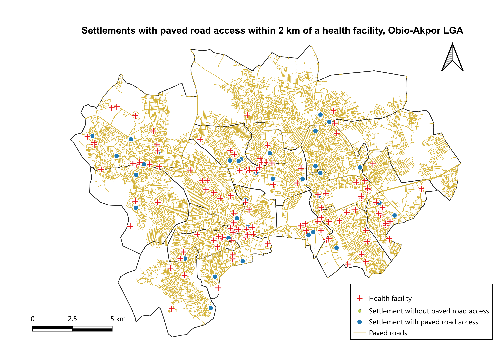

# My GeoDev Lab Africa Project

Which settlements in Obio-Akpor Local Government Area have no paved road access within 2 km of a health facility?

Built over twelve months with GeoDev Lab Africa, Cohort One. See [docs/01-project-brief.md](docs/01-project-brief.md) for the full brief.

## Result

**None of the 37 mapped settlements is unserved.** All 37 are within 2 km of a health facility and within 200 m of a paved road. The farthest from a paved road is Rumu-Okoro-Odomey at 84.2 m (checked by hand at about 81.9 m). The next farthest is Rumuomasi at 73.5 m.

Caveats:
- OSM's surface tag was mostly empty, so I treated motorway, trunk, primary, secondary, tertiary and residential roads (and their link roads) as paved. Nearly all the nearest roads were residential, so the result depends on this choice.
- The 37 settlement points include duplicates, so the true settlement count is lower.
- A result of zero unserved settlements may reflect well-mapped areas in the data rather than the real situation.

The full method, expectations, checks and limitations are in the [month 1 summary](month-1-summary.md).

## Documentation

| Week | File | Purpose |
|------|------|---------|
| Week 1 | [Project brief](docs/01-project-brief.md) | The question, why it matters, data needed, what I'll build |
| Week 2 | [Data notes](docs/02-data-notes.md) | Data sources, fields and quality issues |
| Week 3 | [Data preparation](docs/03-data-preparation.md) | Cleaning, clipping and reprojection steps |
| Week 4 | [Month 1 summary](month-1-summary.md) | Analysis, expectations, checks and limitations |
| Week 4 | [Map](Settlement.png) | Final map of settlements, health facilities and paved roads |

## How the weeks connect

Week 1 set the question and chose the datasets. Week 2 documented the data I downloaded. Week 3 reprojected, clipped and checked it. Week 4 ran the analysis on that prepared data and answered the question.

## Data

- LGA and state boundaries: GRID3 Nigeria operational boundaries
  - [LGA boundaries](https://data.grid3.org/datasets/GRID3::grid3-nga-operational-lga-boundaries/about)
  - [State boundaries](https://data.grid3.org/datasets/GRID3::grid3-nga-operational-state-boundaries)
- Health facilities: [GRID3 Nigeria Health Facilities](https://data.grid3.org/datasets/a0ed9627a8b240ff8b315a84575754a4_0/explore?location=9.073474%2C8.672086%2C5)
- Roads and settlements: OpenStreetMap, downloaded with the QuickOSM plugin in QGIS

Files in this repository:
- `HOSPITAL_CLIPPED.gpkg`: health facilities clipped to the study area
- `Rivers_reprojectedUTM32.gpkg`: Rivers State LGAs reprojected to EPSG:32632

## Method summary

Working in EPSG:32632 (WGS 84 / UTM zone 32N), I buffered the health facilities by 2 km and used Extract by location to find which settlements fall inside. For those, I used Join attributes by nearest against the paved roads to measure the distance to the nearest paved road, and flagged any more than 200 m away. A settlement counts as unserved if it is outside the buffer, or inside it but more than 200 m from a paved road.

## Tools

QGIS, with the QuickOSM plugin.

## Month2: development environment and early Python

-Week 5: set up Python, VS Code and the terminal. hello.py runs.
-Week 6: set up the project with uv and add pandas
